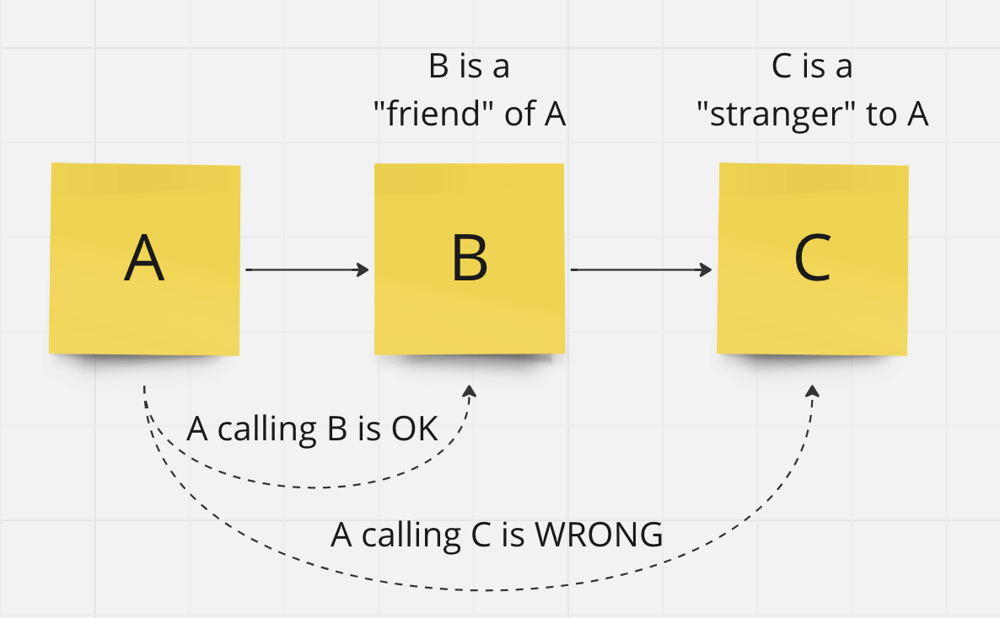

## The Law of Demeter 

### Don't talk to strangers
#### …or just don't breathe down someone's neck

The Law of Demeter aka LoD was introduced to promote loose coupling in complex applications with a deep domain. The idea behind this is just to grow software more naturally. Incrementally — from top to bottom, from the big picture to implementation details. It promotes information hiding with proper abstraction and narrow interfaces. It promotes also a rich model with behaviour.

The object should not know about the innards of objects it manipulates. Objects should hide their data structure and expose their behaviours. In a nutshell inside a method, we should only use parameters or class fields.

### The formal definition
More formally, the Law of Demeter requires that a method m of an object O may only invoke the methods of the following kinds of objects:
- itself
- m's parameters
- any objects created within m
- an object held inside O

#### This repository is a part of my article about Clean Code you can read it here:

[Medium](https://medium.com/@michal.cwiekala/the-law-of-demeter-a7f88b069bdd)

[LinkedIn](https://www.linkedin.com/pulse/law-demeter-micha%C5%82-%C4%87wi%C4%99ka%C5%82a)

